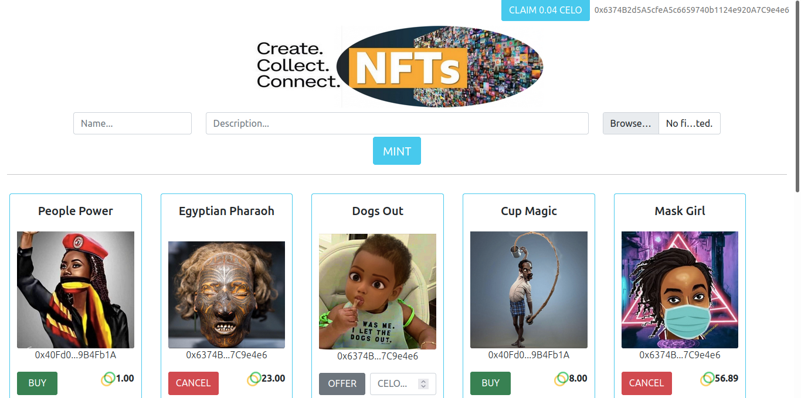

`#Celo Blockchain`

# GETO Studio - NFT Marketplace

This is an open decentralized Multimedia NFT Marketplace built with smart contracts on Celo Blockchain. It basically consists in an open platform where each user can mint his own NFTs and expose them on the marketplace.

## Table of Contents

- [Getting Started](#getting-started)
- [The Project](#the-project)
- [Resources](#resources)

## Getting Started

These instructions will get you a copy of the project up and running on your local machine for development and testing purposes.

### The repository

First, you will need to `clone` or `fork` the repository into your Github account:


```
$ git clone https://github.com/GETOfinance/GETOstudio.git
```

### Installing

First cd into directory, you will need to install the dependencies with: `npm install`.

Run the following command in your terminal after cloning the main repo:

```
$ npm install
```

Then, you will need to install Truffle globally by running the following command int your terminal:

```
$ npm install -g truffle
```

### Running the Tests

First, you will have to compile the smart contracts by running the following command in your terminal:

```
$ truffle compile
```

Then you will have to install and run Ganache to run your blockchain locally:

https://www.trufflesuite.com/ganache

Then, the tests that validate your solution can be executed by runing the following
command:

```
$ truffle test
```

### Deployment on Local Blockchain

Deploy the contracts on your Ganache local blockchain by running the following command:

```
$ truffle migrate --reset
```

### Opening the User Interface

First of all, it is required that you install Metamask wallet as a browser extension: https://metamask.io/

Then you should configure Metamask to connect to your local blockchain run by Ganache. This requires the following:
- Open Metamask
- Open the Network Configuration panel
- Open Custom RPC
- Configure your private network by adding `http://localhost:7545` on the URL and `1337` as a chain ID.
- Import the first Ganache Account to Metamask by copying the Account Private Key from Ganache and pasting it on Metamask

Finally you just need to run the following command in your terminal to open the User Interface:

```
$ npm start
```

### Public Testnet on Celo ALFAJORES

- URL --> https://testnet-nft.geto.finance

### Youtube Demo video

- URL --> https://youtu.be/jFnMJEGsIA8


### Technology stack

- `Solidity`
- `React.js`
- `Truffle`
- `Web3.js`
- `Ganache`
- `Node.js`
- `Metamask`
- `IPFS`

## The Project

This project consists of an open platform where each user can mint his own NFT and expose it on a marketplace by making an offer or buying NFT from others. It includes:

- A smart contract which represents a collection of NFTs by following the ERC-721 standard
- A smart contract which represents the NFT Marketplace and contains all the logic to make offers, fill offers...
- Tests build with JavaScripts to ensure smart contracts are accomplishing the expected functionalities
- A React.js front-end application for a responsive user interface for both web and mobile

### Project architecture


The user can access the application via web-browser, and he must have the Metamask wallet installed. This interface, built with React.js, relies on the web3.js library to communicate with the smart contracts through Metamask. This means that the data reflected on the front-end application is fetched from the Celo blockchain. Each action performed by the user (mint a NFT, offer NFT, buy NFT...) creates a transaction on Celo, which will require Metamask confirmation and pay a small fee, and this transaction will permanently modify the state of the NFTCollection and NFTMarketplace smart contracts. On top of it, the user will upload the NFT Metadata to the IPFS, creating a permanent hash which will be permanently recorded on the blockchain itself to prove ownership.

### NFT Marketplace features



The user can perform the following actions on this NFT Marketplace:

#### Mint

The user must input a name, description and upload a file (image) to mint his own NFT. Once minted, a representation of this NFT will be displayed in the marketplace and initially it will be owned by its creator. This is open for everyone, meaning everyone can participate in this NFT creation. 

#### Make Offer

The user can offer his NFT by specifying its price (in CELO). If someone fulfills this offer, then the NFT ownership is transferred to a new owner. 

#### Cancel Offer

The user can cancel an offer he did in the past if in the end he does not want to sell his NFT or wants to adjust the price.

#### Buy

A user can buy those NFT which someone else offered for sale in the marketplace. This will require paying the requested price (the CELO will be transferred to the smart contract to be claimed later on).

#### Claim Funds

If a user sold an NFT, he can claim his funds by clicking the button in the top-right.

## Resources

- [Celo Blockchain](https://celo.org/)
- [truffle suit](https://www.trufflesuite.com/)
- [node.js](https://nodejs.org/)
- [web3.js](https://web3js.readthedocs.io/)
- [react.js](https://reactjs.org/)
- [IPFS](https://ipfs.io/)


# ⚡ Make Crypto Mobile 📱 Hackathon ⚡

Make Crypto Mobile Hackathon is a 4-week hackathon, focused on growing Mobile DeFi (#MoFi), NFT's and developer tooling on the Celo platform.

## Hackathon Tracks: 

 - __DeFi Track:__ 
 	- Build decentralized finance applications
 	- Tools
 	- Infrastructure
 - __NFT, Gaming and Creator Track:__ 
 	- Build an application to mint, sell or manage non-fungible tokens
 - __Infrastructure and Web3 Track:__ 
 	- Build or update existing decentralize web applications
 - __Green Track:__ 
 	- Build or update an SDK to improve developer resources
 - __Interoperability Track:__ 
 	- Build or update cross-chain applications
 	- Cross-chain tooling

## Timeline

 - Hackathon Oct 8th - Nov 5th, 2021
 - Hackathon Kick off - Oct 8th, 2021
 - Submissions Due - Nov 5th, 2021
 - Evaluations - November 6th-14th, 2021
 - Winners announced - November 15th, 2021

## Process
**Hackathon participats will need to:**

 1. [Fork this repo](#hackathon-repo-process)
    - Modify with your project details and merge
    - When your project is ready for final submission, push your codebase & assets
  2. Utilize [DevPost](https://mobiledefi.devpost.com/) to:
	 - Manage and collaborate with your team
	 - Submit your project for final evaluation

## Hackathon Repo Process

 1. Fork this repo
    - Press the Fork button
 2. Create project branch
 3. Make your changes within new branch!
	 - Copy **Project_Name** folder & rename with your project name
	 - Modify project details within your project folder **Readme.md**
		 - Name
		 - Description
		 - Team members & roles
 4. Add, commit, and push the changes
	 - Add the files you've changed and commit them with a descriptive message.
 5. Submit your pull request
    -  Submit to the maintainers for approval. Head over to the original repositories Pull Requests tab, you should see an automatic suggestion from GitHub to create a pull request from your new branch.
    -  Utilize your project name as the title for your initial pull Requests
    -  Provide a brief project description within the pull request comment

***Congrats, your officially a Mobile DeFi Hackathon participant!***


## Developer tools and resources

This section contains information about some of the key tools and resources that will help developers start building applications on Celo.

For a comprehensive list of resources and information, review [Celo Docs.](https://docs.celo.org/)

### QUICK START GUIDES

View the [Developer Code Examples page](https://docs.celo.org/developer-guide/start) to get started using the Celo SDKs with guided coding exercises.

### TOOLS

#### SDKs

-   [ContractKit](https://docs.celo.org/developer-guide/contractkit)
-   Javascript package of Celo blockchain utilities
-   Manage connections to the Celo blockchain, accounts, send transactions, interact with smart contracts, etc.
-   A set of wrappers around the core protocol smart contracts to easily connect with contracts related to governance, validators, on-chain exchange, etc.
-   Includes [web3.js](https://web3js.readthedocs.io/en/v1.2.4/)
-   [Celo Ethers.js Wrapper](https://github.com/celo-tools/celo-ethers-wrapper) (experimental)
-   A minimal wrapper to make [ethers.js](https://docs.ethers.io/v5/) compatible with the Celo network
-   [use-contractkit](https://github.com/celo-tools/use-contractkit)
-   A [Web3Modal](https://web3modal.com/)-like experience that injects ContractKit into your web-based application. Supports a variety of different wallets, including but not limited to Valora, Ledger, Metamask (Celo compatible fork) and any WalletConnect compatible wallets
-   [DappKit](https://docs.celo.org/developer-guide/dappkit)
-   Easily connect to the [Valora](http://valoraapp.com/) wallet with your React Native mobile application
-   Valora manages user account, private keys and transaction signing, so you can focus on building your dapp
-   Learn more and see the code with the [Dappkit truffle box](https://github.com/critesjosh/celo-dappkit)
-   [Python SDK](https://github.com/blaize-tech/celo-sdk-py)
-   [Java SDK](https://github.com/blaize-tech/celo-sdk-java)


#### Infrastructure

-   [Valora](https://valoraapp.com/) provides a clean, intuitive UI where users can send transactions and interact with smart contracts
-   [Forno](https://stackedit.io/developer-guide/forno)
-   Node access service so you can connect your dapp to the Celo blockchain without having to run node infrastructure
-   [ODIS](https://stackedit.io/developer-resources/contractkit/odis.md)
-   Oblivious decentralized identity service
-   Lightweight identity layer that makes it easy to send cryptocurrency to a phone number
-   Blockscout block explorers
-   [Alfajores testnet](http://alfajores-blockscout.celo-testnet.org/) & [mainnet](http://explorer.celo.org/)
-   [Stats.celo.org](http://stats.celo.org/) to check network activity and health


#### Networks

-   [Alfajores Testnet](https://docs.celo.org/getting-started/alfajores-testnet)
-   [Faucet](https://celo.org/developers/faucet) for free testnet CELO and cUSD
-   [Forno](https://docs.celo.org/developer-guide/forno) supports connections to alfajores
-   Requires Alfajores Celo wallet for mobile device testing (please request, support@clabs.co)
-   [Baklava testnet](https://docs.celo.org/getting-started/baklava-testnet) for validators and testing protocol changes


#### Ethereum Tools

-   Similarities between Celo and Ethereum means you can use many of the most popular Ethereum developer tools.
-   Celo supports the EVM, so tools for writing smart contracts in Solidity (or any language that compiles to EVM bytecode) are compatible with Celo
-   ERC20, NFT (ERC721) and other smart contract interface standards are supported, see [Celo for Ethereum Developers](https://docs.celo.org/developer-guide/celo-for-eth-devs)
- [Truffle](https://www.trufflesuite.com/)
- [OpenZeppelin](https://openzeppelin.com/)
- [Remix](https://remix.ethereum.org/)

#### Ongoing projects

-   [Community projects](https://docs.celo.org/developer-guide/celo-dapp-gallery)
-   [Grant recipients](https://celo.org/experience/grants/directory)

#### Web wallets
  -  [celowallet.app](https://celowallet.app/)
  -  [Celo Terminal](https://github.com/zviadm/celoterminal/)


#### Community

-   Join our [Discord](https://chat.celo.org/)
-   [Discourse Forum](https://forum.celo.org/)
