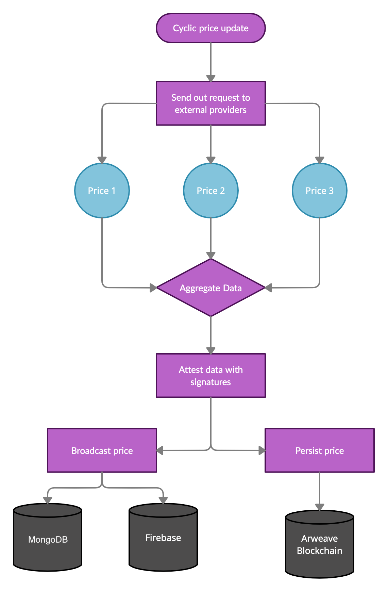

# RedStone Node

RedStone Node is a core module in the [RedStone ecosystem](docs/COMPILED_ORACLE_DOCS.md), which is responsible for fetching data from different sources and broadcasting it to the Arweave blockchain and the RedStone cache layer.

You can check the compiled oracle documentation [here.](docs/COMPILED_ORACLE_DOCS.md)

## 📖 Main concepts
| Concept | Description |
|---|---|
| Provider | An entity that fetches the data from external APIs, transforms it to a standard format, and persists collected information in the Redstone data ecosystem. Each provider has a running instance of redstone-node |
| Fetcher (source) | A module responsible for fetching the data from an external API. Examples: [coinbase fetcher](/src/fetchers/coinbase), [ecb fetcher](/src/fetchers/ecb/EcbFetcher.ts) |
| Manifest | Public JSON file that defines the provider's obligation regarding the data that they provide. It sets fetching interval, tokens, sources and other public technical details |
| Config | **Private** configuration file created by provider |
| Signer | A module responsible for data signing. Examples: EvmPriceSigner, ArweavePriceSigner |
| Aggregator | A module responsible for aggregating the data fetched from different sources. [Median aggregator](src/aggregators/median-aggregator.ts) is used by default  |
| Broadcaster | A module responsible for broadcasting the signed data. Currently it sends the signed data to the RedStone cache layer. This data may be fetched then through the [RedStone API](http://api.docs.redstone.finance/) |
| Arweave | Arweave is a new type of blockchain that allows to store data on Blockchain with much lower costs. It is used by RedStone protocol for storing data |

## 📜 Instructions
- [Running a node](docs/RUN_REDSTONE_NODE.md)
- [Prepare config file](docs/PREPARE_CONFIG.md)
- [Prepare manifest](docs/PREPARE_MANIFEST.md)
- [Add new source](docs/ADD_NEW_SOURCE.md)
- [Add new token](docs/ADD_NEW_TOKEN.md)
- [Publish to NPM](docs/PUBLISH_TO_NPM.md)
- [Deploy manifest on Arweave](docs/DEPLOY_MANIFEST_ON_ARWEAVE.md)
- [Configure node monitoring](docs/MONITORING_TOOLS.md)

## ⚙️ How it works

### Top level view
In a cycle, we perform 3 major activities:
- **Data fetching** - gathering information from external sources
- **Data processing** - aggregating data and attesting with signature
- **Data broadcasting** - publishing data to users and persisting it on-chain

### Process view
This component fetches pricing data and makes it available to end users. The process consists of the following steps:
- **Data fetching** - getting data from public or private api and transforming it the standard format
- **Data aggregation** - combining data from multiple sources to produce a single feed using median or volume weighted average
- **Data attestation** - signing data with the provider's cryptographic key
- **Data broadcasting** - publishing the data on publically available message board (like public firebase store)
- **Data persistence** - securing packaged data on the Arweave blockchain



## 🛠 Implementation
Each group of subcomponent implements a generic interface and is inter-changable with other implementations:
- **Fetchers:** connect to external api, fetch the data and transform it to the standard form <em>Examples: coingecko-fetcher, uniswap-fetcher</em>
- **Aggregators:** take values from multiple sources and aggregate them in a single value <em>Examples: median-aggregator, volume-weighted-aggregator</em>
- **Signers:** sign the data with the provided private keys <em>Examples: ArweaveSigner, EthSigner</em>
- **Broadcasters**: publish the data and signature <em>Examples: FirebaseBroadcaster, SwarmBroadcaster</em>
- **Runner:** execute the entire process in a loop

## Data format

### JSON ticker
The price (ticker) is represented as a single JSON object
```js
{
  "id": "6a206f2d-7514-41df-af83-2acfd16f0916",
  "source": {"coingecko": 22.05, "uniswap": 22.03, "binance": 22.07},
  "symbol": "LINK",
  "timestamp": 1632485695162,
  "version": "0.4",
  "value": 22.05,
  "permawebTx":"g3NL...", // id of Arweave tx that includes this ticker
  "provider": "I-1xz...", // Address of the provider's arweave wallet
  "signature": "0x...",
  "evmSignature": "0x..."
}
```

### Arweave transaction
Price tickers are aggregated per provider and timestamp and persisted on the Arweave chain. The provider is the tx sender.

#### Transaction tags
```js
{
  "app": "Redstone",
  "type": "data",
  "version": "0.4",
  "Content-Type": "application/json",
  "Content-Encoding": "gzip",
  "timestamp": 1632485616172,
  "AR": 45.083730599999996
}
```

#### Transaction data
We encrypt transaction data using [gzip algorithm](https://www.gzip.org/) to minimize transactions cost. We don't store signature for each price on the Arweave blockchain, because each transaction is already signed using default Arweave transaction signer.
```js
[
  {
    "id":"a890a16a-ef4a-4e45-91fa-0e4e70f28527",
    "source":{
      "ascendex":41415.797549999996,
      "bequant":41437.738515,
      ...
    },
    "symbol":"BTC",
    "timestamp":1632486055268,
    "version":"0.4",
    "value":41416.892911897245
  },
  {
    "id":"81f8c1cc-5472-4298-9d9d-ea48b226c642",
    "source":{
      "ascendex":2820.8997449999997,
      "bequant":2823.8562225,
      ...
    },
    "symbol":"ETH",
    "timestamp":1632486055268,
    "version":"0.4",
    "value":2821.3399649999997
  },
  ...
]
```

## Next steps
* **Flexible data format** - supporting multiple types and formats of data instead of simple price values
* **Virtual nodes** - ability to quickly run data provider service without the need to configure the node infrastructure
* **Improved aggregation logic** - implementing multiple types of aggregation (e.g. time-weighted avg) based on users needs and empirical findings
* **Full implementation of dispute resolution** - implementing and testing the disputes resolution protocol
* **Code audits** - auditing the core parts of the codes, especially the smart contracts responsible for data transfers to EVM


## Flowcharts
### Node runner flow


### Median aggregator flow


## 👨‍💻 Development and contributions
We encourage anyone to build and test the code and we welcome any issues with suggestions and pull requests.

### Installing the dependencies
```bash
yarn install
```

### Running the tests
```bash
yarn test
```

### Building typescript to javascript
```bash
yarn build
```

## 🙋‍♂️ Need help?
Please feel free to contact us [on Discord](https://redstone.finance/discord) if you face any problems.

## 📜 License
This software is licensed under the MIT © Redstone
