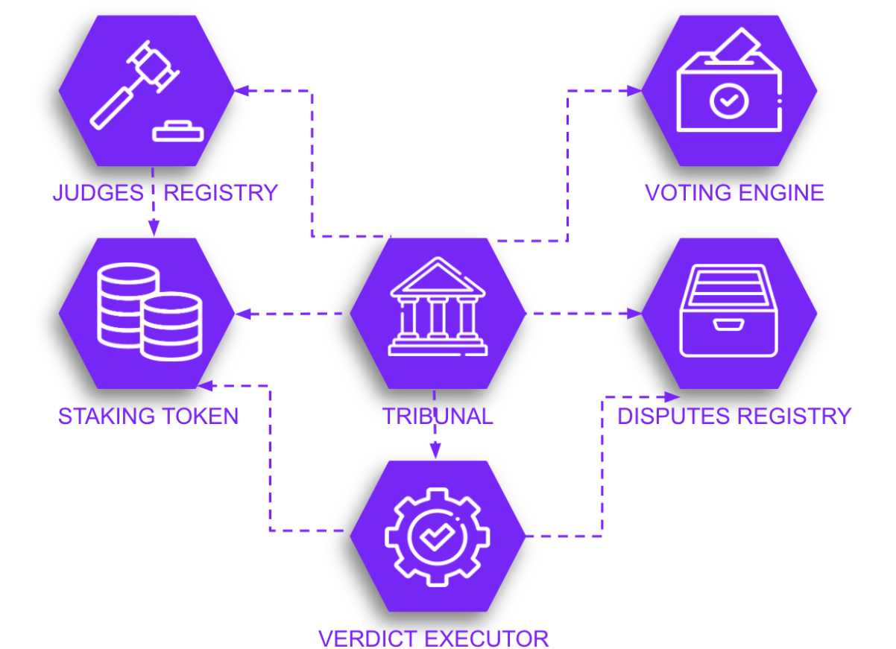

# ARgue - Decentralised Dispute Resolution Protocol

## Introduction
Decentralised data feeds have many advantages over centralised competitors. They are more secure, lacking a central point of failure and more censorship-resilient because of diversified governance. However, it’s not trivial to manage data integrity and accuracy without a central point of control.

ARgue protocol enables high data integrity preserving the benefits of keeping a fully decentralised and diverse set of data providers. Users are incentivised to report problems with data quality by opening a dispute. Disputes are resolved by a panel of jurors who vote by staking tokens. The consensus is based on the majority rule, where voters are rewarded for voting alongside others and penalised for being outliers.

The majority rule is the most common strategy for reaching coordination in a decentralised environment. It was researched as a part of game theory studies in the 60s, and the current implementations are based on the work of Thomas Schelling and his idea of the focal point described in the book Strategy and Conflict.

One of the adaptations of this idea was drafted by Vitalik Buterin in 2014 as a Schelling Coin concept. It was also proposed as an architecture for the Ethereum Price Feeds: “For financial contracts for difference, it may actually be possible to decentralize the data feed via a protocol called SchellingCoin” (from the Ethereum whitepaper). However, the network congestion, high gas price and the extreme storage cost of the Ethereum Virtual Machine rendered the solution impractical at the current level of technology.

New generations of blockchains like Arweave could finally make the implementation of Schelling-point based algorithms economically feasible due to the cheaper storage and low contracts execution cost. The challenging part is setting the system parameters to keep the user friction as low as possible and reduce the voting requirement voting while maintaining the high quality of decisions. Hopefully, the recent simulations done by the Redstone team prove that even a small percentage of expert jurors could produce high-quality results when the incentives are properly set up (see the simulations of TCR-based decision model presented during EdCon Paris 2019).

## Dispute process
The dispute is a multi-stage process that involves two main counter-parties: a challenger, who initiates the dispute, a provider, who originated the challenged data entry and a jury panel that makes the final decision. The actors are incentivised to participate with potential token rewards. All of the stages of the process are described below:

### 1. Pre dispute
A data provider may deposit collateral as a signal to the users that there is a strong financial commitment to maintaining the quality of data. The higher the collateral means the higher potential reward for the challenger but it also translates into a higher fee to open a dispute.

### 2. Opening dispute
Anyone could open a dispute providing he can deposit an initial stake which is proportional to the provider’s deposit. There is also a minimum stake value introduced to avoid spamming. The challenger stake is locked until the dispute is settled.

### 3. Voting
Jurors vote by staking their tokens either to support or reject the dispute. The maximum amount of tokens that could be staked is limited by their an additional parameter called voting capacity (see the challenges section for more details).
Voting lasts until a deadline which is typically a week.

### 4. Verdict
If a required quorum is reached before the deadline, the choice with the highest amount of token staked is called a verdict. A party that is not satisfied with the verdict may submit an appeal during the appeal window (typically 3 days). If there is no appeal the verdict is considered final and the settlement is executed.

### 5. Appeal
An appeal submission requires doubling the current challenge fee. It will restart the voting and double the required quorum. If the quorum is already above 50% it is impossible to submit another appeal and the current verdict is considered final.

### 6. Settlement
After the verdict is final the winning party receives a reward which is taken either from a challenger fee or provider deposit. Part of the reward is distributed to the judges. There is also an internal redistribution of tokens among the judges. Those supporting the majority choice get part of the tokens staked on the losing side. The jurors who were on the winning side also increased their voting capacity. The results are persisted on the permaweb and could be used as a base for reputation score for providers, watchers and jurors.

## Dispute parameters
The list below contains system parameters used to manage the dispute resolution process. The values are based on the similar existing models and simulations, therefore they might require tuning after the deployment in the real-world environment. The update could be managed by decentralised governance in the form of token weighted voting by all the stakeholders.

| Parameter | Default value | Description |
|---|---|---|
| voting duration | 7 days | A period when jurors are able to vote on the dispute |
| appeal window | 3 days | A time when the losing side could submit an appeal |
| base quorum | 5% | A minimum percentage of total token supply that needs to be staked during the voting |
| escalation factor | 2x | A multiplier that is applied both to the quorum and challenger fee after the appeal |
| min challenge fee | 100 RDST | A minimum amount of tokens that need to be staked by the watcher (challenger) |
| judgement fee | 20% | Part of the voting stake (from challenger or provider) that is redistributed to the jurors |
| voting penalty | 10% | Part of the losing jurors’ stake that is redistributed to the one who supported the final verdict.  |

## Architecture
The diagram below presents smart-contracts with their connections and descriptions below.

**Tribunal** - a master contract orchestrating the dispute process and linking all the dependent components

**Disputes Catalog** - a contract storing current and past disputes with their metadata, status, stake and references to all the parties involved

**Judges Registry**  - a contract keeping a track of jurors with their voting capacity

**Voting engine**  - a contract containing the logic for voting rules, describing the procedure and implementing possible privacy-preserving solutions

**Verdict executor**  - a contract authorised to reallocate tokens according to the results of voting and set the final dispute outcome

**Staking token** - a profit-sharing token that enables staking on a specific topic, in this context, on the dispute-decision key

## Challenges

### Low turnout
Many blockchain voting systems suffer from voters’ apathy as governance proposals cannot attract the required quorum. Redstone mitigates this problem by introducing a gradual voting scheme. For the first voting on a dispute, there is a low quorum that increases with every appeal. This allows to resolve uncomplicated cases with little friction but allows for proper verification and majority voting if the case is complex enough.

### Vote buying
Decentralised voting systems use tokens to express voting power. Although the freedom to trade is a necessary feature of every token, buying a large amount of tokens just before important voting could derail the entire system. Not addressing this point was one of the most criticised vulnerabilities of the Aragon court. Redstone mitigates the issue by introducing another dimension to token ownership called holding capacity. It represents the maximum amount of tokens a juror could hold that can increase only as a result of making correct decisions. This ensures that jurors could gradually earn their voting power and the system is immune to short-term votes buying

### Jurors selection
Jurors benefit from participating in the judgement, therefore there may be a tough competition to vote for a high-stake dispute. To prevent front-running and guarantee an equal right to vote for all the token holders, Redstone plans to implement a random-based selection process. The chances to be selected as a judge are proportional to the voting capacity, a variable that describes that increased gradually with every successful choice made by a juror. This ensures that the best arbiters will have the most opportunities to resolve disputes.

### Privacy
In most of the cases, public voting will be sufficient and the most cost-effective method to judge the dispute. However, in special cases involving high-stake or confidential content, there could be a need for a privacy-preserving process. We could easily extend the voting mechanism implemented by the Tribunal contract to support either a two-phase commit-reveal process or use zero-knowledge proofs of jurors’ decision.
