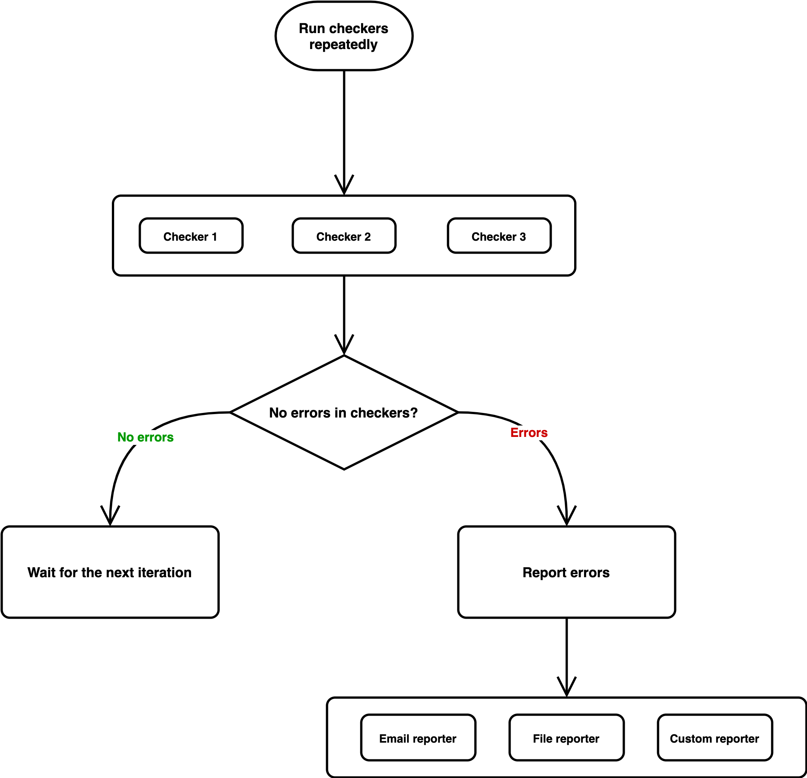

# RedStone node monitoring tools

It's insanely important for oracles to provide high quality data without interruptions.
So, the node operators need to monitor their nodes and immediately fix any potential problems.

That's why we've implemented a special app [redstone-node-monitoring](https://github.com/redstone-finance/redstone-node-monitoring), which is executed in a loop and automatically verifies if a selected node regularly publishes new data to the RedStone cache layer and the Arweave blockchain. In each loop iteration multiple checkers are executed. And if any of these checkers fail then the error is reported.

**Checker** - a module responsible for data intergtity checking. It can check the number of saved data points during last 5 minutes or the timestamp of the latest saved data point.

Implemented checkers:
- **ArPriceReturnedRedstoneRapid**
- **ArPriceReturned**
- **ArweaveTimestampDelay**
- **HistoricalPricesReturned**
- **StockPricesReturnedRedstoneStocks**
- **TimestampIsCloseToNowRedstoneRapid**
- **TimestampIsCloseToNow**

**Reporter** - a module responsible for error/warning reporting. For example, it can notify a node operator via email, SMS or discord. It can also save a notification to a text file. Currently we send email notifications to our developer team and save logs in AWS Cloudwatch.

You can find more details about running or extending this monitoring service in the [redstone-node-monitoring](https://github.com/redstone-finance/redstone-node-monitoring) GitHub repo.
