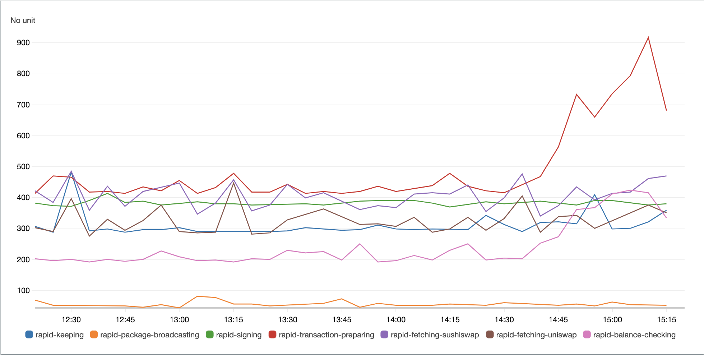

# RedStone Node performance tracking

Performance tracking is enabled in production environment and tracks by default all of the most important processes during each nde iteration. Currently we save perofmance data in AWS cloudwatch, where it can be analysed using convenient chart tool:

We track performance for the following processes:
- processing-all
- balance-checking
- fetching-all
- fetching-[SOURCE_NAME]
- signing
- broadcasting
- package-broadcasting
- transaction-preparing
- arweave-keeping

If you set `PERFORMANCE_TRACKING_LABEL_PREFIX` environment variable, its value will be appended to the performance tracking labels (for example: `rapid-processing-all` for `PERFORMANCE_TRACKING_LABEL_PREFIX=rapid`)
