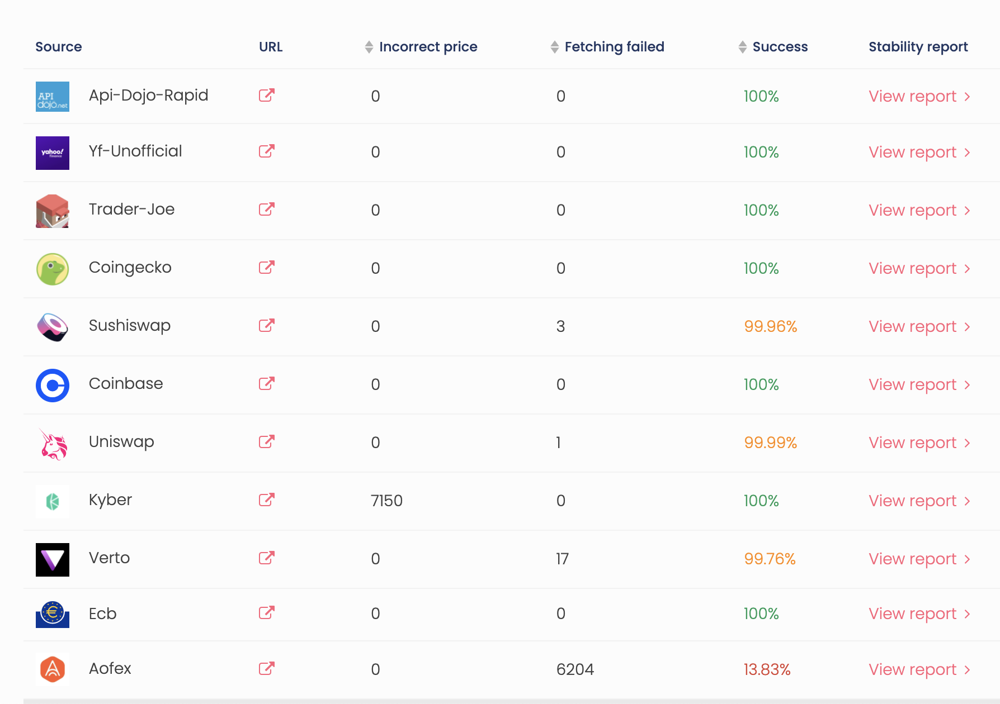

# How to prepare a new manifest
Manifest is a public JSON file that defines the provider's obligation regarding the data that they provide. It sets fetching interval, tokens, sources and other public technical details for the provided data.

## Examples
These are examples of ready-to-use manifests:
- [main.json](../manifests/main.json) - 1000+ tokens, used by the main redstone provider
- [rapid.json](../manifests/rapid.json) - 10 most popular tokens, used by `redstone-rapid` provider
- [coinbase.json](../manifests/coinbase.json) - 20 tokens, uses only coinbase fetcher

## Manifest structure
| Param | Optionality | Type | Description |
|---|---|---|---|
| interval | required | Number | Data fetching interval in milliseconds |
| priceAggregator | required | String | Aggregator id. Currently only `median` aggregator is supported |
| defaultSource | optional | String[] | Array of fetcher names that will be used by default for tokens that have no specified sources |
| sourceTimeout | required | Number | Default timeout in milliseconds for sources |
| maxPriceDeviationPercent | required | Number | Default maximum price deviation percent for tokens. It may also be set for each token separately |
| evmChainId | required | Number | EVM chain id, that will be used during EVM price signing. Pass `1` if you're not sure, it will point to the Ethereum Mainnet.  |
| tokens | required | Object | Object with tokens in the following format: `{ "TOKEN_SYMBOL": { "source": ["source-name-1", "source-name-2", ...], "maxPriceDeviationPercent": 25 }, ...  }`. Note that `source` and `maxPriceDeviationPercent` params per token are optional. This is also a correct tokens configuration: `{ "TOKEN_SYMBOL_1": {}, "TOKEN_SYMBOL_2": {} }` |

## Manifest file
You should place your JSON manifest file inside the `manifests` folder. The manifest file should be named using kebab case, i.e: `manifest.json`, `good-manifest.json`, or `your-source.json`.

You can also publish your manifest to the Arweave smart contracts using this [manifest deployment guide.](./DEPLOY_MANIFEST_ON_ARWEAVE.md)

## Available sources
You can find a list of available sources along with its stability details in the RedStone Web app: [app.redstone.finance/#/app/sources.](https://app.redstone.finance/#/app/sources)

