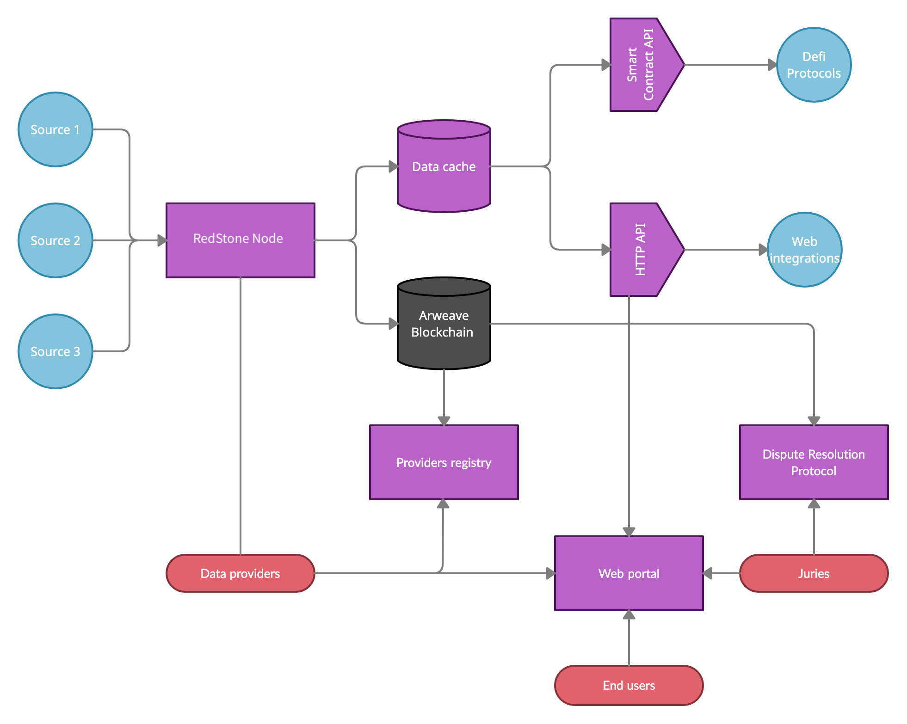

# Technical design of RedStone ecosystem

## Overview
Redstone is a data ecosystem that should deliver fast and accurate financial information in a decentralised fashion.

### Problem Statement (Defi Pain points)
- It is very expensive to put all the pricing data on-chain (it cost more than 2m to do it for Ethereum Defi with Chainlink)
- To reduce costs current providers cover only a small subset of tokens (Chainlink: 25) and have low update frequency (Chainlink: 10m)
- DeFi protocols cannot expand beyond a small set of assets and cannot offer advanced solutions like margin lending (which require higher update frequency)

### Proposed Solution
- Leverage Arweave blockchain as a cheap and permanent storage
- Use token incentives to motivate data providers to maintain data integrity and the uninterrupted service
- Use signed meta-transactions to deliver prices on-chain

## Top level view
The ecosystem could be divided into 3 main areas:

- **Data provision** responsible for fetching the data from external api, transforming to a common format, and persisting collected information.
  - Implemented as → [RedStone Node](https://github.com/redstone-finance/redstone-node)
- **Data access** responsible for serving data to end user by various means including web portal, http api, discord bots, on-chain feeds or 3rd party applications (like spreadsheet extensions)
  - Web portal → [RedStone App](https://github.com/redstone-finance/redstone-app)
  - HTTP Api → [RedStone Api](https://github.com/redstone-finance/redstone-api)
  - Bots → [Examples](https://github.com/redstone-finance/redstone-api/tree/main/examples/discord-bots)
- **Data integrity** responsible for enforcing high quality of data by incentivising providers with tokens for keeping their service and punishing them for outage and misrepresented data
  - Concept → [Argue protocol](https://docs.google.com/document/d/1S-R7x3jWCO9ouFofHcyimZZQLwP7UwOg9EKozBinDSQ)

## System architecture

### External integrations (blue)
- **Data sources** - provide data (like price information) via API
- **DeFi protocols** - consume aggregated and attested data
- **Web integrations** - utilise provided data to power apps like blockchain wallets, portfolio browsers, defi analytics sites

### Stakeholders (red)
- **Data providers** - need to register with token stake and operate RedStone node which process and attest data
- **End users** - may browse pricing data and select providers using the web portal
- **Juries** - protect data integrity deciding if a price was manipulated

### RedStone modules (purple)
- **RedStone node** - fetches data from external sources via api, aggregates and attest information with a cryptographic key, broadcast the results and persist them on the Arweave blockchain
- **Data cache** - a module that holds data and makes it available to interested parties. Multiple services might implement it on various infrastructure to increase availability. It should achieve minimum latency and scale to handle large volume of requests
- **Smart contracts api** - it provides the data to on-chain protocols. Initially, we cover Arweave and EVM (ethereum) infrastructure. It minimizes the running (gas) costs and verifies signed data on-chain
- **HTTP api** - web based that serves information via REST api. It can power websites, node-js scripts and social media bots. There will be a dedicated java script wrapper that will abstract request formatting and error handling to make service easier to integrate
- **Providers registry** - an Arweave smart contract that manages provider's token stake, holds the manifesto (SLA of pricing data) and allows checking historical performance (showing any data inconsistency and downtime)
- **Dispute resolution protocol** - a set of Arweave contracts allowing to challenge any existing pricing feed, and managing the dispute process enabling juries to vote for the verdicts
- **Web portal** - a web application that is an interface to browse data, check providers' statistics, see historical feeds with an option to raise a dispute and participate in the voting process
