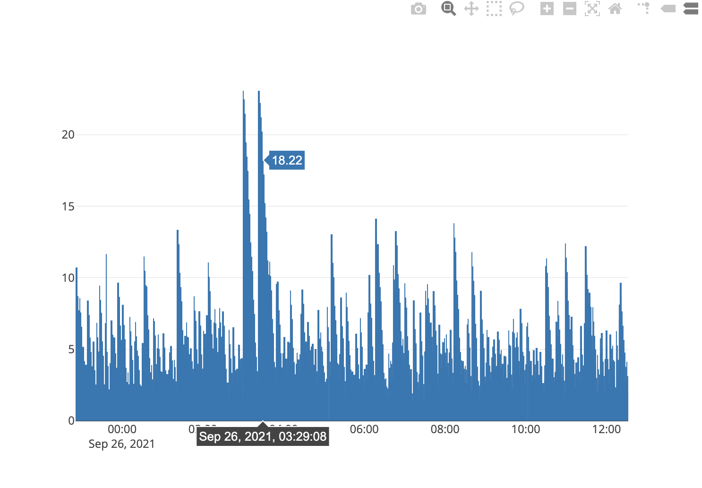

# RedStone node tools

## Intro
There are multiple helpful tools (Node.js scripts) to automate different repeated tasks related to the redstone-node configuration.

## Arweave tools

⚙️ [tools/arweave/get-tx-status.js](../tools/arweave/get-tx-status.js)

Prints status of the transaction with the given transaction id.

Usage: `node tools/arweave/get-tx-status <TRANSACTION_ID>`

⚙️ [tools/arweave/generate-tx-time-report.js](../tools/arweave/generate-tx-time-report.js)

Generates a chart with time differences between prices timestamps and corresponding timestamps of the Arweave transactions.

Usage: `node tools/arweave/generate-tx-time-report.js`

It shows the generated chart in the default web browser:

⚙️ [tools/arweave/generate-new-jwk.js](../tools/arweave/generate-new-jwk.js)

Generates a new Arweave wallet. Prints wallet JSON to stdout.

Usage: `node tools/arweave/generate-new-jwk.js`

⚙️ [tools/arweave/check-failed-transactions.js](../tools/arweave/check-failed-transactions.js)

Prints all transaction IDs for the last 24 hours with their statuses.

Usage: `node tools/arweave/check-failed-transactions.js`

## Ethereum tools

⚙️ [tools/ethereum/generate-random-private-key.js](../tools/ethereum/generate-random-private-key.js)

Generates a random ethereum private key and prints it to standard output.

Usage: `node tools/ethereum/generate-random-private-key.js`

⚙️ [tools/ethereum/get-address-from-private-key.js](../tools/ethereum/get-address-from-private-key.js)

Calculates a public address for the provided ethereum private key.

Usage: `node tools/ethereum/get-address-from-private-key.js <PRIVATE_KEY>`

## Manifest generation tools
⚙️ [tools/manifest/generate-main-manifest.js](../tools/manifest/generate-main-manifest.js)

Generating manifest for the main redstone provider. This script automatically merges all manifests from the `manifests` folder, excluding `manifestsToExclude` configured in the script.

Usage: `node tools/manifest/generate-main-manifest.js`

⚙️ [tools/manifest/generate-rapid-manifest.js](../tools/manifest/generate-rapid-manifest.js)

Generating manifest with a subset of tokens from the `main.json` manifest.

Usage: `node tools/manifest/generate-rapid-manifest.js`

## Config generation tools

⚙️ [tools/config/generate-sources-config.js](../tools/config/generate-sources-config.js)

Generating sources configuration file based on predefined-config and CCXT api.

Usage: `node tools/config/generate-sources-config.js`

⚙️ [tools/config/generate-tokens-config.js](../tools/config/generate-tokens-config.js)

Generating tokens configuration file with all supported tokens using different APIs.

Usage: `node tools/config/generate-tokens-config.js`

⚙️ [tools/config/analyze-tokens-config.js](../tools/config/analyze-tokens-config.js)

Analyzing tokens config file. Calculating total assets count, assets with node details / logos / names / URLs, tags and providers distribution.

Usage: `node tools/config/analyze-tokens-config.js`
