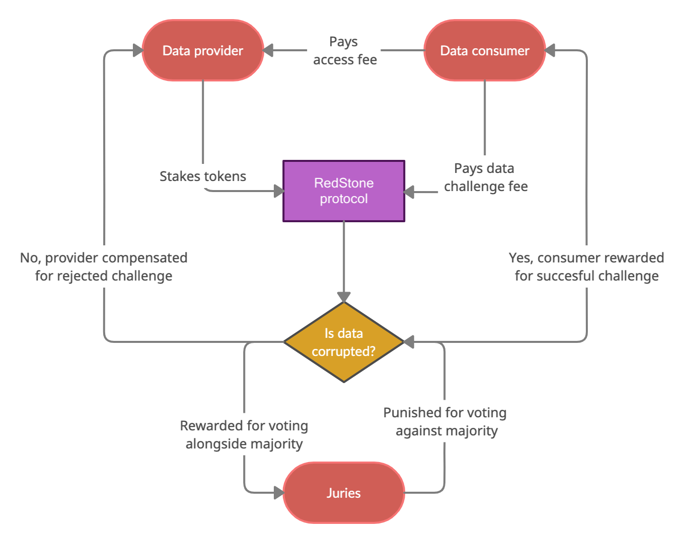

# RedStone Token design

## Brief description

The token facilitates providing reliable and accurate information to blockchain networks from the external world.

The token will be used to:

1. Reward data providers for delivering accurate information in a continuous manner
2. Ensure data integrity by requiring providers to deposit a stake (collateral) which could be slashed in case of a service outage or a delivery of faulty data
3. Incentivise community to resolve disputes about the data quality through token-based voting on the subject if the delivered data is accurate

## Longer description

### Usage of the token
Tokens are proven to be a very useful tool for achieving coordination in the distributed systems and aligning incentives of various actors. RedStone token facilitates data sharing ecosystem incentivising participants to produce, publish and validate data in a continuous and diligent way.

#### Data access fees
The end users who benefit from access to valuable information use tokens to reward providers that published these data. The exact fee and the subscription terms are at the discretion of the provider and depend on their effort, demand for data and potential competition.

#### Staking
Every provider needs to publish a Service Level Agreement describing the scope of data being served, the source of information, and the frequency of updates. In case a provider breach the terms of service, there will be a penalty applied which is also denominated in tokens. In order to assure users that any further claims could be fully covered, providers need to put aside a certain amount of token and lock it for a period of time. These funds are labelled as a stake in the ecosystem and are an important factor for users to select the most reliable provider. 

#### Dispute resolution
Because of the diverse nature of provided information, it will not always be possible to decide if a data was corrupted. Therefore, it will be necessary to have fallback procedure to resolve any disputes about data quality. The process could be facilitated by tokens when juries will be rewarded for voting alongside the majority and punished for supporting a losing side.

#### Bootstrapping market
At the early stage of development, the token could be distributed to providers to reward their availability and bootstrap the market before there is enough demand coming for data users.

