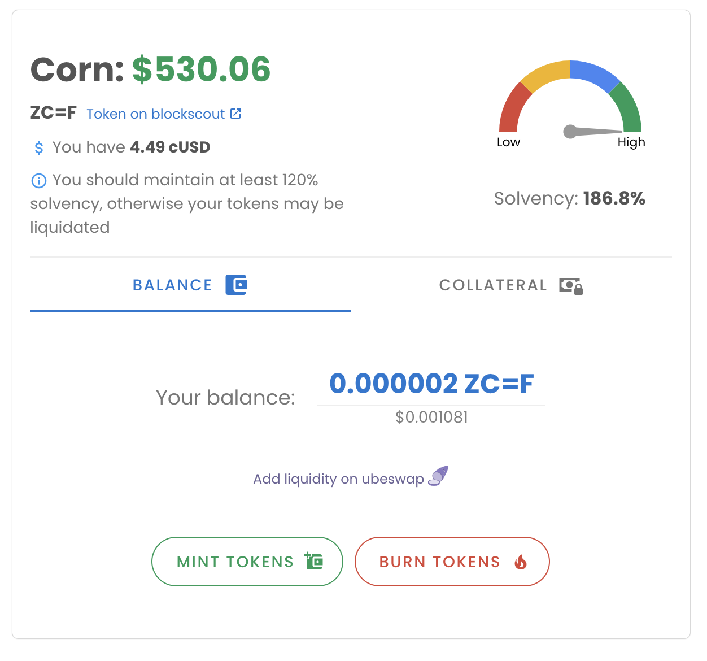
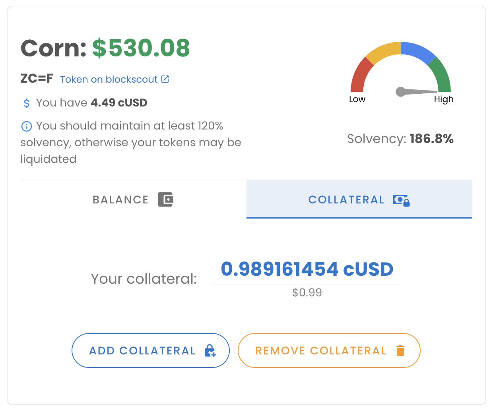
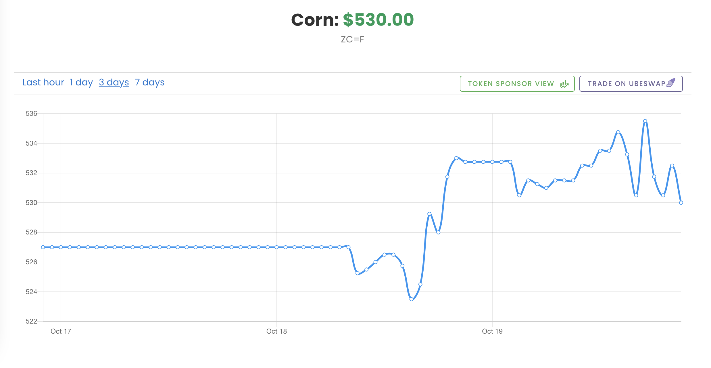
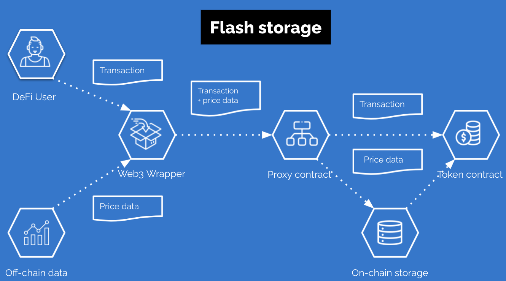
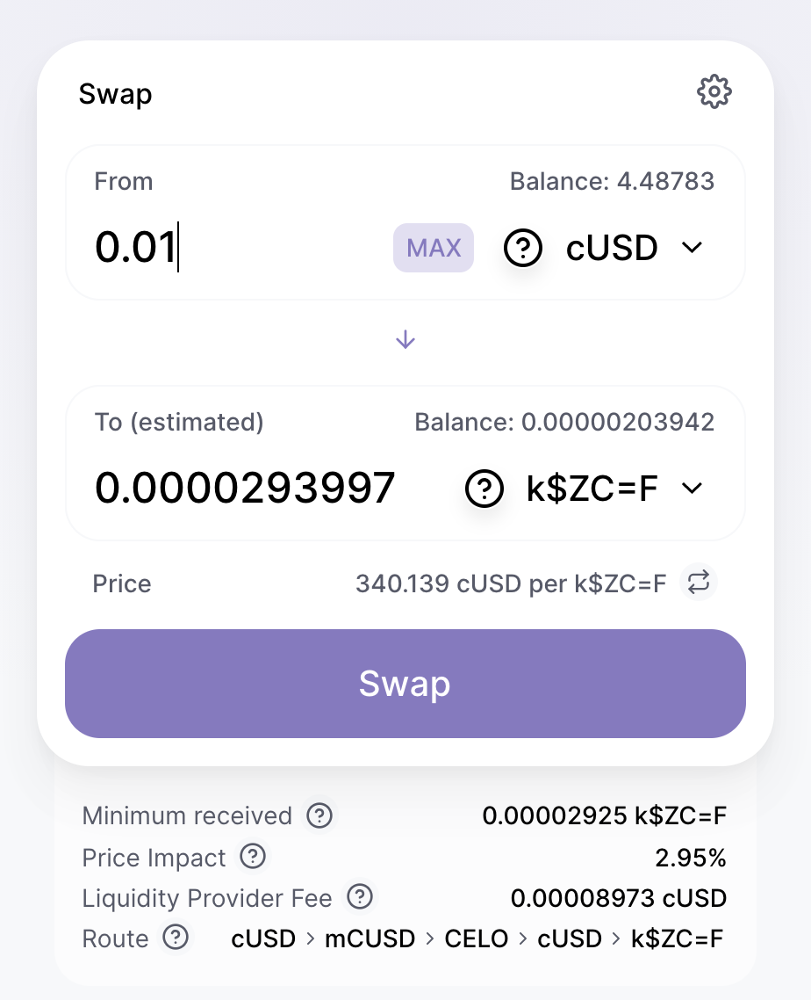

<!-- TODO - add a new demo -->
<!-- [WATCH THE DEMO](https://www.youtube.com/watch?v=NWzhxIb5Y0s) -->

# Komodo - Commodities trading protocol on Celo

DeFi is known for its lucrative yield farming and liquidity mining possibilities. However, the newly created derivatives are becoming more and more leveraged and the trading activity is contained in a bubble detached from the real economy. We want to bridge the DeFi infrastructure to the real world and encourage DeFi users to invest in the traditional form of mining and farming by allowing them to trade commodities.  

The commodity trading sector is a large and growing market estimated at $20 trillion. It faces many challenges that hamper its growth. High brokerage and clearing fees are causing friction for traders. The market is also fragmented and less accessible from areas lacking proper financial services infrastructure. 

Komodo is aiming to solve the problems by building a global and distributed infrastructure for commodities trading. Our solution is based on an open, smart-contract protocol that enables anyone to create synthetic commodities which creates the opportunity for investors and helps miners and farmers hedge their business risk.

## Built on Celo blockchain
The komodo protocol is built on the Celo blockchain facilitating its high performance and convenience of the built-in stable **cUSD** token.

We've deployed the komodo web app to the celo alfajores testnet:
[alfajores-komodo.redstone.finance](https://alfajores-komodo.redstone.finance)

## How to use the app

Please complete the following steps to use the komodo application:

- Add celo alfajores testnet to Metamask (select the "Alfajores Testnet" tab). [Learn more](https://docs.celo.org/getting-started/wallets/using-metamask-with-celo/manual-setup#adding-a-celo-network-to-metamask)
- Add cUSD token to Metamask (select the "Alfajores Testnet" tab). [Learn more](https://docs.celo.org/getting-started/wallets/using-metamask-with-celo/manual-setup#adding-tokens-eg-cusd-ceur)
- Fund your account with CELO and cUSD tokens. [Learn more](https://celo.org/developers/faucet)
- Visit [alfajores-komodo.redstone.finance](https://alfajores-komodo.redstone.finance)
- Connect metamask to the app and have fun :)

## How we built synthetic commodities
We decided to base our architecture on the popular and battle-tested **CDP** (collateralized debt position) pattern.
Minting synthetic commodities could be viewed as increasing the debt that needs to be backed by adequate collateral.
The collateral of every user is kept in a segregated account limiting personal risk. 
We calculate the value of collateral and debt in real-time and the ratio is called a solvency score. 
All the parameters could be actively controlled by users in the interface:
<p align="center">
  
</p>
<p align="center">
  
</p>
We automatically enforce that every user action must leave the system in a solvent state:

```js
modifier remainsSolvent() {
  _;
  require(solvencyOf(msg.sender) >= MIN_SOLVENCY, "The account must remain solvent");        
}
```

When it drops below a safe level (currently 120%), everyone can liquidate part of the position, forcibly exchanging commodity tokens for collateral at a discounted rate:

```js
function liquidate(address account, uint256 amount) public {
  require(solvencyOf(account) < MIN_SOLVENCY, "Cannot liquidate a solvent account");
  this.transferFrom(msg.sender, account, amount);
  super._burn(account, amount);
  debt[account] -= amount;

  // Liquidator reward
  uint256 collateralRepayment = amount * priceFeed.getPrice(asset);
  uint256 bonus = collateralRepayment * LIQUIDATION_BONUS / SOLVENCY_PRECISION;

  uint256 repaymentWithBonus = collateralRepayment + bonus;
  collateral[account] -= repaymentWithBonus;
  usd.transfer(msg.sender, repaymentWithBonus);

  require(solvencyOf(account) >= MIN_SOLVENCY, "Account must be solvent after liquidation");
}
```

Currently, we support both **CELO** and **cUSD** as collateral. 


## Data access

The most challenging part of our development was providing the real-world pricing data to our synthetic smart-contracts.

<p align="center">
  
</p>

We've been considering multiple oracle solutions. Chainlink offers the most convenient way of accessing the data directly from on-chain storage with Price Reference Data. However, the list of supported tokens is controlled by the sponsors and it's not easy to add new positions. On the other hand, UMA is very efficient with the priceless model but the data is not available on-chain and the process of getting actual feeds requires multiple transactions. 

We decided to hack our own solution that could match the convenience of Chainlink with the efficiency of UMA. We called it "flash storage" as the data is available within a context of a single transaction. When a user sends a transaction, it’s supplemented with signed pricing data and directed to a proxy contract. The proxy contract strips the data out of the transaction. It verifies its integrity by checking the signature and saves the data on-chain. 
The raw transaction is forwarded to the commodity token contract which may conveniently access information from on-chain storage. The data may be erased afterwards to save the costs or kept for others.  


The following diagram shows how we provide data to Komodo Token contract:

<p align="center">
  
</p>

1. We fetch the data from [Redstone API](https://redstone.finance/)
2. We attach the data to a transaction sent by a user
3. The transaction is intercepted by a proxy contract, which separates the data piece and the original transaction content
4. The data part is verified on-chain by ECDSA signature check and put into on-chain storage
5. The original transaction is forwarded to the Komodo token contract and executed in a context that could conveniently access the data on-chain
 

## Leveraging DeFi composability

### Ubeswap
We automatically generate ubeswap pools for every token pair (25 pools in total).

<p align="center">
  
</p>

# Project setup & deployment

## Project setup
```
yarn
```

### Compiles and hot-reloads for development
```
yarn serve
```

### Compiles and minifies for production
```
yarn build
```

### Lints and fixes files
```
yarn lint
```

### Run contract tests
```
yarn test
```
