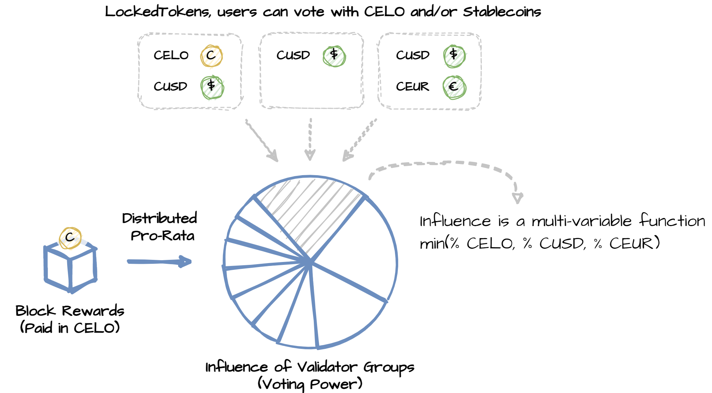
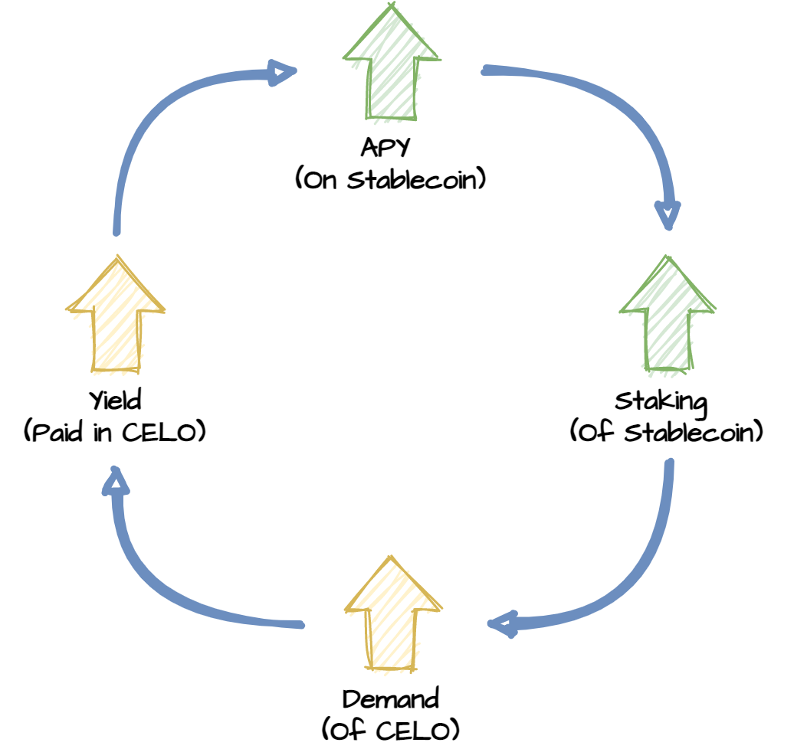
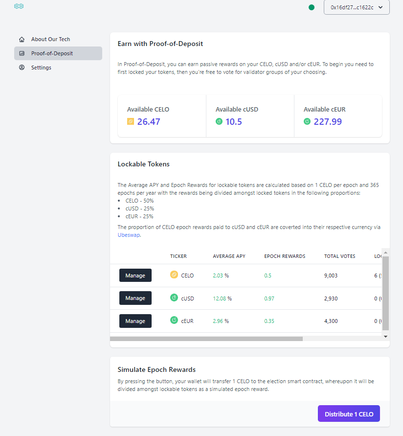
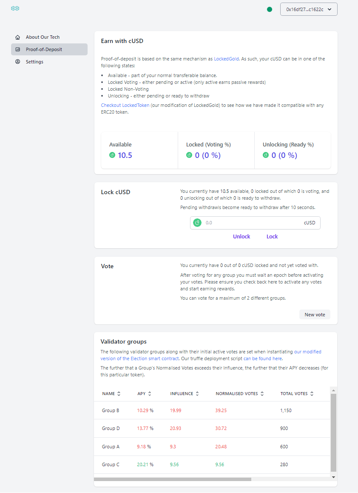

# ⚡ Cambridge Cryptographic's Hackathon Submission ⚡

**Hackathon Track:** DeFi Track

**Project Name:** Proof-of-Deposit

**Team:** Cambridge Cryptographic

**Location:** United Kingdom (Cambridge)

**Live WebApp (with smart contracts on Testnet):** https://hackathon.cambridgecryptographic.com/

**Video Demonstration:** https://youtu.be/pISbvBeTbRg

**Team Members:**
- Ying Chan, lead developer
- John Fletcher, mathematician / economist
- Marcin Wojcik, developer

# What is Proof-of-Deposit?
Our project, using proprietary blockchain-agnostic tech developed at [Cambridge Cryptographic](https://www.cambridgecryptographic.com/), has a simple but profound aim:

> Leveraging block rewards to create a **"risk-free" rate** on stablecoins (e.g. cUSD and cEUR)

The significance of this lies in the fact that block rewards comprimise minted CELO and fees from the entire on-chain economy! This will create a significant market for stablecoins (if not the biggest one by far!).

**Proof-of-Deposit** achieves this by allowing the "staking" of, not one, but multiple tokens. One of those tokens must be CELO whose value is strongly coupled to the network (to serve as strong Sybil-defence), but the other tokens can be stablecoins! When block rewards are distributed, it creates in-effect a **"risk-free" rate** on stablecoins. 

We call this scheme **Proof-of-Deposit** rather than **Proof-of-Stake** as the value of "deposited" stablecoins are not "at stake" (i.e. validators may not be risking loss of purchasing power from their stablecoins if they act incorrectly)

## Benefits of Proof-of-Deposit

**Proof-of-Deposit** brings significant benefits that complements Celo's philosophy of providing accessible, mobile-first payments in a token that maintains stable purchasing power:

1. **Tapping into the biggest and most important userbase: those that cannot or do not want take risk with their money such as regulated custodian, banks and risk-averse individuals.**

    These users, by increasing the liquidity of the stablecoins, help to stablise the peg as the liquidity serves as a buffer when sell-offs occur. The reason that these users will hold cUSD, cEUR, etc is due to the APY offered by **Proof-of-Deposit** (users will deposit if they deem APY to be attractive, and withdraw if they deem it too low).  

2. **Amplifying demand for CELO and stablecoins**

   Unlike lending protocols, **Proof-of-Deposit** gives a **"risk-free" rate** where there is no risk of losing your principal. Unlike swap protocols, **Proof-of-Deposit** pays rewards from newly minted CELO (as opposed to a separate token) and from a transaction fees paid by the entire on-chain economy.

   As users who deposit stablecoins earn a passive income paid in CELO, this creates a positive feedback loop: 
   
   i.  CELO price increase -> APY on stablecoin increases

   ii. Demand for stablecoin increases (to deposit in order to receive the APY) -> CELO price increases (due to CELO being used as collateral for stablecoin mechanism)  

      

3. **A new tool for central banks: monetary policy with configurable discretion**

    By providing a risk-free rate in a decentralised setting, Proof-of-Deposit enables central banks  to choose to limit their discretion over monetary policy.  Remarkably, (and perhaps counterintuitively) choosing to limit discretion in this way can greatly strengthen the de facto independence of a central bank. Benefits to strong independence include:

    i. Enhanced credibility (particularly valuable for e.g. emerging economies, as it may permit borrowing in a currency that they issue (on affordable terms).

    ii. Incomplete independence has been shown to cause a down trend in interest rates, which leads to rates eventually hitting zero, whereupon the effectiveness of monetary policy is severely impaired ([see our paper summary for detail](http://files.cambridgecryptographic.com/whitepapers/configurable_discretion_v0.1.pdf)).

    

# Overview of Implemented Functionality
## Smart Contracts ([located here](./codebase/contracts))

For this hackathon, we sought to showcase how **Proof-of-Deposit** could be integrated with Celo. To achieve this, we isolated and made modifications to the following [Celo Governance Smart Contracts](https://github.com/celo-org/celo-monorepo/tree/master/packages/protocol/contracts/governance):

1. `LockedGold.sol` (our abstract version is called `LockedToken.sol`)

    i. Modified `lock` and `withdraw` to be compatible with any `ERC20` token (e.g. cUSD, and cEUR)

    ii. Modified the `constructor` to `LockedToken` to be instantiated with a particular `ERC20` token and other initial parameters

    iii. Removed unnecessary dependencies for our proof of concept

2. `Election.sol`

    i. Modified the `constructor` to allow `Election.sol` to be instantiated with multiple `LockedTokens` (e.g. our proof-of-concept uses `LockedCGLD`, `LockedCUSD` and `LockedCEUR`) along with other initial parameters.

    ii. Extended most class variables to be mappings where the key is a `LockedToken` address (such as `LockedCGLD`, `LockedCUSD`, etc)

    iii. Modified almost all functions to include a `address token` parameter, where a specific `LockedToken` address needs to be provided. (e.g. `function vote(address token, address group, uint256 value, ...)` needs to define which `LockedToken` is being used to vote)

    iv. Implemented functions to introduce `"normalised votes"` (e.g. `getGroupTotalVotesNormalised(address token, address group)`), where a normalised vote is the fraction of votes from a particular `LockedToken` for a validator.

    v. Implemented functions to introduce `"influence"` (e.g. `getGroupInfluenceFromTotalVotes(address group)`), where influence is calculated as the `min` over all normalised votes from different `LockedTokens` for a validator.

    vi. Modified `distributeEpochRewards` so that we can showcase how epoch rewards are distributed amongst multiple `LockTokens`.

    vii. Removed unnecessary dependencies for our proof of concept

## WebApp ([located here](./codebase/webapp))

We used [plock.fi](https://github.com/AlexBHarley/plock.fi) as a "SDK" to showcase a possible UI to interact with **Proof-of-Deposit**:

1. **Proof-of-Deposit** overview page that shows all of a user's Lockable tokens, and their respective stats (e.g. average APY):

  

2. Lockable token management page that allows a user to Lock/Unlock/Withdraw their tokens, Vote with Locked Tokens, as well as see validator group stats (e.g. APY):

  

## Analysis ([located here](./codebase/marketcap_model))

We formally analysed the increased demand for CELO and stablecoins that **Proof-of-Deposit** 

You can view a forecast of the marketcap calculated by our model on [our live WebApp](https://hackathon.cambridgecryptographic.com/).

# Next Steps

For this hackathon we have implemented a proof of concept version to showcase our tech, and have provided preliminary analysis. Next steps are divided between mainnet deployment and CBDC routes:

## Mainnet Deployment

Towards the goal of getting this live:

1. Stringent analysis on the economic and security implications of our tech (e.g. contracting https://chaoslabs.xyz/)

2. Thorough investigation of breaking changes in the wider ecosystem that can come from modifying `Election.sol` and `LockedGold.sol` (e.g. other smart contracts, wallets, `celo-tools`, etc). 

3. Collaborate with cLabs and Mysten Labs to test/architect/develop our tech with a clear phase-in plan. (Unclear if modification/integration of existing governance smart contracts is best way forward)

4. Seek to modularise the "risk-free" rate tech such that it can be used for simulations (e.g. economic analysis) as well as potentially packaging it into a marketable product.

## CBDC

1. Continue our collaboration with economists at IMF, ESM and BoE Advisory Group to produce papers on how blockchains allow for monetary policy with configurable discretion.

2. Collaborate with CBDC team at cLabs

3. Lots of presentations and talks... (its the long game with Central Banks)

# URLs
1. [Live WebApp](https://hackathon.cambridgecryptographic.com/)
2. [Video Demonstration](https://youtu.be/pISbvBeTbRg)
3. [Presentation Slides](./assets/presentation.pdf)
4. [Our Whitepaper - A Market Determined Risk Free Rate](http://files.cambridgecryptographic.com/whitepapers/risk_free_v0.4.pdf)
5. [Our Analysis - A MarketCap Model for Proof-of-Deposit](http://files.cambridgecryptographic.com/whitepapers/marketcap_model_v0.1.pdf)
6. [Our Summary on CBDCs - Monetary Policy with Configurable Discretion](http://files.cambridgecryptographic.com/whitepapers/configurable_discretion_v0.1.pdf)

# Intellectual Property

The modifications to [`Election.sol`](./codebase/contracts/contracts/Election.sol) and [`LockedToken.sol`](./codebase/contracts/contracts/LockedToken.sol) are the object of the following patent applications: EP20275088.1, GB2016187.3, GB2016186.5.
