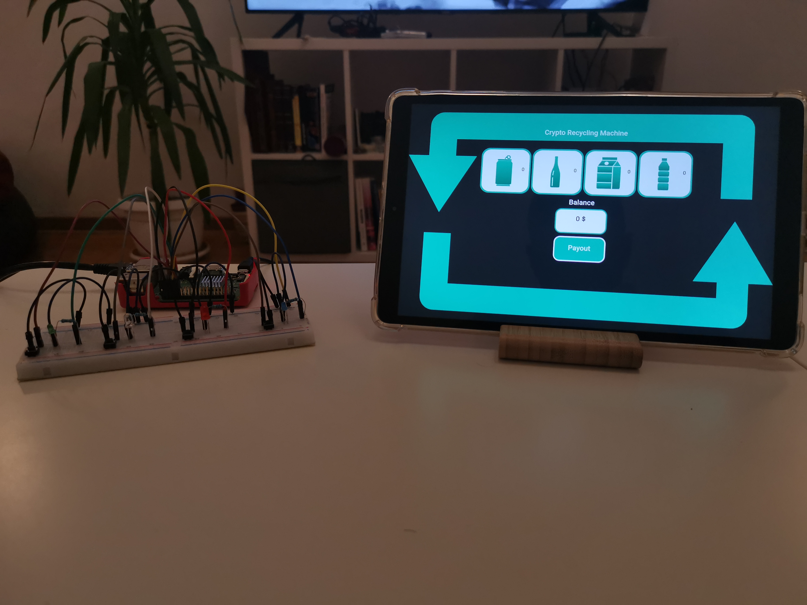

# CELO Make Crypto Mobile Hackathon 2021

<div align="center">
    
</div>

## Crypto Recycling Machine Overview
Crypto Recycling Machine is a project developed for Celo Make Crypto Mobile Hackathon. It gives an opportunity to recycle different kinds of bottles and get paid in crypto currency.

The project consists of 2 units:
* ### Recycling Machine Emulator

A service running on Raspberry Pi which uses a breadboard, some LEDs and buttons to simulate inserting the bottle into the recycling machine. Each button on the breadboard represents an inserting different kind of bottle: Aluminium cans, glass bottles, tetra pak, or PET.

* ### Recycling Machine server and client

Used for user interaction with the machine and interaction between the recycling machine and smart contracts on Celo network. The Recycling Machine supports payments on Celo Alfajores network in CELO tokens or in cUSD tokens. There is also an option to donate the money.


## Technologies
* React
* Node.js
* Solidity
* Docker

## Project developed with
* [Celo](https://docs.celo.org/developer-guide/overview)
* [Remix IDE](https://remix.ethereum.org/)


## Quick start

## Prerequisites
* [Node 12+](https://nodejs.org/en/download/)
* [Yarn](https://classic.yarnpkg.com/en/docs/install/)
* [Metamask wallet](https://chrome.google.com/webstore/detail/metamask/nkbihfbeogaeaoehlefnkodbefgpgknn) - wallet should have [Celo Alfajores Testnet](https://docs.celo.org/developer-resources/testnet-wallet) network configured
* Raspberry Pi 3B/3B+/4B, a breadboard, LEDs, buttons. If not available, see [the option without Raspberry Pi](https://github.com/aleksandargolubovic/make-crypto-mobile-hackathon/blob/CryptoRecyclingMachine/recycling_machine/recycling_machine_emulator/README.md#option-without-a-raspberry-pi)
* Docker

## Recommendations for client side of the app

- The application is optimised for display with 16:10 ratio
- Recommendation is to run it with Chrome browser
- Since QR scanner is using cammera, it needs to be [enabled in Chrome for (Local) Unsecure Origins](https://medium.com/@Carmichaelize/enabling-the-microphone-camera-in-chrome-for-local-unsecure-origins-9c90c3149339)

## Initial Setup

- Copy the source of /make-crypto-mobile-hackathon/recycling_machine/contracts/RecyclingMachine.sol into Remix IDE
- Using Remix IDE, compile and deploy RecyclingMachineFactory and PackagePrices contracts
- Using Remix IDE, create a new RecyclingMachine contract from the RecyclingMachineFactory instance (call CreateRecyclingMachine() function)
- Rename /make-crypto-mobile-hackathon/recycling_machine/server/.env.example to .env and provide your wallet PRIVATE_KEY, contracts' addresses and other required fields


## How to run

Recycling machine services and Raspberry Pi emulator should be run in the same local network (It's not mandatory, but it makes the life much easier).
First we need to start recycling machine services, and then the emulator, which needs to know the IP address of the server.

- To start the recycling machine services, go to root directory and run the following:
```bash
docker-compose build
docker-compose up
```
- After the docker containers are built and started, there should be two services running: a frontend service on http://localhost:3050/ and backend service on http://localhost:3050/api/
- Then we need to start an emulator on Raspberry Pi. It's recommended to use Ubuntu Server OS for Raspberry Pi.
- Copy the source from /recycling_machine_emulator to your Raspberry Pi.
- Find an IP address of the host which runs backend service.
- run
```bash
yarn
yarn start [backend-service-ip-address]:3050/api
```
- That's it! All the services should be up and running!

## Demo
https://www.youtube.com/watch?v=OSghLNtftY0

## Future work/TODO
Implement a back office web3 app, which will be used to manage the recycling machine contracts. It will allow administrator to deploy a new Recycling Machine contracts, manage existing ones and follow theirs statistics. For example, admin could see the balance, total amount donated, number of payouts, etc.
