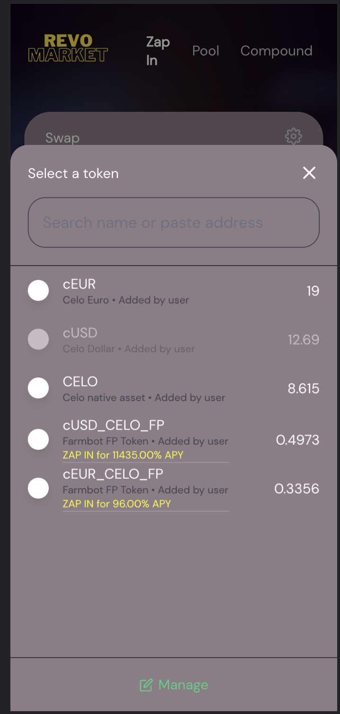
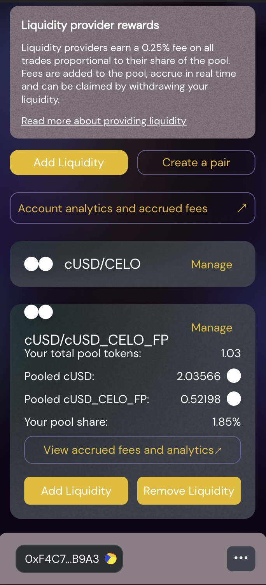

# Revo

### Region
San Francisco, CA

### Team Members
- Charlie Andrews-Jubelt, developer
- Lisa Li, developer
- Joseph Bergeron, developer

#### URLs
* [Revo GitHub organization](https://github.com/revo-market)
* [Prototype frontend (Alfajores only)](https://disco-circuit-333421.ue.r.appspot.com/)
* [Revo contracts](./codebase/contracts/)
* [Revo interface](https://github.com/revo-market/revo-interface)
* [Revo arbitrage bot](https://github.com/revo-market/revo-arbitrage-bot)
* [Revo auto-compounding bot](./codebase/scripts/compound.ts)

#### Presentation
* [Demo video URL]()

#### Project Photos
<figure>

<figcaption align = "center"><i>Swapping CELO directly for an autocompounded stake in a cUSD/CELO yield farm</i></figcaption>

</figure>

 
 

<figure>

<figcaption align = "center"><i>Adding liquidity to a cUSD/FP liquidity pool, allowing users to "zap-in" for FP tokens</i></figcaption>

</figure>

 
 

<figure>

<figcaption align = "center"><i>Viewing current autocompounded positions and FP balances</i></figcaption>

</figure>

 
## Project Description
### Inspiration

Yield farming on top of being a liquidity provider can offer excellent incentives, and can act as a great way to get into the defi ecosystem. Often, however, rewards from yield farming sit stagnant and unclaimed. In order to get the greatest return from a yield farm, you have to manually reinvest your rewards, often daily. This is an extremely involved process, and requires deep knowledge of defi concepts. "Autocompounders" for yield farming positions _do_ exist, but still require deep defi knowledge, charge extremely high fees, are poorly decentralized, and are not extensible. For the crypto newbie, entering the defi world with yield farming is still not an accessible option.

### What it does

Our project, **Revo** (_"dream"_ in Esperanto), allows users to directly exchange **any** ERC20 token (think: `cUSD`, `cEUR`, `CELO`) for a staked, auto-compounded position in an underlying yield farm. The onboarding process takes only seconds, fees are extremely small (on the order of magnitude of traditional "swap" fees), and the auto-compounding process is completely decentralized. This allows all users, and importantly, those new to defi, to "zap-in" to an auto-compounded yield farming position in only a few clicks -- in less time than it would traditionally take to join a yield farm _without_ auto-compounding!

Auto-compounded shares of yield farming positions are implemented as ERC20 tokens themselves, which means that users can _directly_ move between auto-compounded positions in different yield farms. Traditionally, moving capital between different yield farms was a painstaking and expensive process; you have to unstake your LP, burn it, swap the component tokens to new ones, mint new LP, and finally stake it. This is a tiring, and potentially costly process, incurring several swap fees along the way; at the end of it all, you're left with a staked position that you _still_ have to compound manually. Being able to move directly between auto-compounded positions in underlying yield farms is both easier and cheaper than the traditional approach.

### How we built it

Auto-compounded shares of staked yield farming positions are implemented as **tokenized shares** of an ERC20-compliant smart contract, referred to as **FP**, or __Farm Point__ tokens. For each underlying farm, an FP contract is deployed. Users can deposit LP tokens of the underlying farm in order to mint FP for themselves; the FP contract will hold the user's LP tokens and stake them in the farm on their behalf. Ownership of any amount of FP tokens represents a stake in an auto-compounded yield farm; as rewards are auto-compounded, each FP becomes worth more of the underlying LP. At any point, a user may burn their FP in exchange for an amount of LP according to the current conversion ratio between FP and LP.

Auto-compounding is implemented via a public method on the FP contract that anyone can call to re-invest any staking rewards that are owed to the FP contract. To incentivize users to call this method, the caller is rewarded with a small fraction of the claimed rewards, on the order of a traditional "swap" fee; currently, this sits at around 0.1% of rewards. We have released an open-source bot which will automatically call the compound function when it's in the caller's financial interest to do so. We hope that this encourages community members to run the bot in order to support the Revo platform.

The above summary doesn't explain how the "zap-in" feature from any ERC20 token works. Both the "zap-in" feature and the ability to directly swap between auto-compounded stakes in different farms are direct results of the fact that "Farm Points" are implemented as ERC20 tokens themselves.

By deploying traditional liquidity pools between commonly-used ERC20 tokens (e.g., `cUSD`, `cEUR`) and each of our FP tokens, users are able to directly swap for auto-compounded shares of yield farms. Note, that by only deploying one pool per FP token, users are now able to swap _any_ ERC20 token for FP tokens, so long as there exists a swap path between the original token and the FP token. A direct result of this is that users are able to swap one FP for another, moving freely between auto-compounded yield farming positions in different farms.

As more users "zap-in" to FP positions, the liquidity in the ERC20-FP pools may become imbalanced; this could result in it being cheaper to swap for FP than it is to mint it directly by depositing LP, or vice-versa. In either case, an arbitrage opportunity exists, where users can mint new FP and swap it in the liquidity pool for a free profit, or swap for FP for cheaper than it would cost to mint it. This opportunity for arbitrage actually encourages new LP to be minted, directly supporting liquidity in the underlying pools, and the health of the Celo ecosystem at large. As more users "zap-in" for FP shares, the presence of arbitrage opportunities ensures that new FP, and thus LP, will be minted. To encourage users to engage in this arbitrage, we have written and published an open-source arbitrage bot to perform this arbitrage on the Revo platform.

On top of all the infrastructure and tooling, we have also written and deployed a user-friendly, mobile-first frontend for the Revo platform, where users can swap their tokens directly for auto-compounded yield farm positions (FP), provide liquidity to the Revo liquidity pools, and directly mint or burn their FP in exchange for LP of the underlying farm.

### Challenges we ran into

We certainly ran into a bunch of challenges along the way. Of course, the challenge of writing correct smart contract code existed throughout the process, but by far the most difficult part was coming up with a truly decentralized protocol that's **gas-efficient** and incentivizes users to support the auto-compounding process. Some short-term concessions had to be made for the sake of time; a few  parameters of the FP contracts are only configurable by the owner, such as slippage tolerance, reward rate for the auto-compound caller, and swap paths for reinvesting rewards.

Another challenge was developing a deep understanding of the underlying smart contract structure of current yield farming systems. Since our FP contracts interact very closely with the inner workings of yield farms, there was a steep learning curve around the underlying yield farming systems.

### Accomplishments that we're proud of

We're extremely proud of the platform we've developed, both for how it can be leveraged by defi power users and crypto newbies alike, and the technological innovation it presents. Primarily, we're proud to have created a system that can drastically ease the on-ramp to defi, and provide a useful service for more experienced users who are looking for a way to move between yield farming positions easily. The fact that we were able to do this at an extremely low cost to end-users and in a truly decentralized way is something we're very happy with.

On the technological front, we're proud of the innovation of representing auto-compounded yield farm stakes as shares of an ERC20-compliant token. Tokenizing an auto-compounded yield farming share was kind of a mind-blowing idea to us, and something that none of us had seen in defi before. Implementing FP as an ERC20 token opens up a ton of space for future development and for others to build on top of our platform, and we're really excited about what could come next.

### What we learned

We learned a ton about what it takes to deploy a proper dApp from start to finish, including protocol design, writing smart contracts, providing developer tooling for ecosystem support, and shipping an MVP frontend. There's a ton of work required to get a platform like this off the ground! We also learned a lot about the current pains involved with yield farming and compounding rewards. We learned about current solutions for these problems on the Celo platform, and how they are less than ideal at addressing some of the more fundamental issues and pains around participation in yield farming.

### What's next for Revo

We have a bunch of plans for improving and extending Revo. Due to the time constraints of the hackathon, we were not able to implement as much as we would have liked to, and had to make some compromises in order to get a working prototype off the ground before the deadline.

Currently, Revo only supports underlying yield farms from the Ubeswap platform. One obvious extension to the platform is adding support for yield farms on different underlying platforms, such as [Sushi](https://sushi.com) and [Symmetric](https://symmetric.finance/). This would allow users to directly swap between autocompounded positions on different yield farming platforms.

Another huge milestone we'd love to reach is the issuance of a governance token. Currently, key contract parameters are not determined in a fully decentralized way. By issuing a governance token, we can allow users of the platform to vote on parameters such as reward rates for auto-compounders and swap paths. Additionally, we could use the governance token as a reward for users who call the auto-compound function on our contracts in order to make our platform __truly free__ for FP holders. We could also deploy yield farms for our liquidity pools and provide governance token rewards to those who stake their LP.

